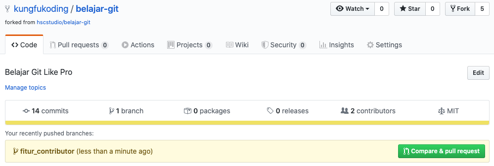
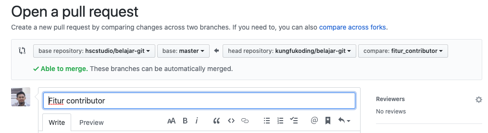

# belajar-git

Repositori (repo) ini dibuat untuk memudahkan kamu dalam belajar menggunakan git dengan cara langsung praktek. Sekaligus belajar bagaimana cara berkontribusi pada projek yang menggunakan git atau dalam hal ini github.

## Langkah Pertama!

Beberapa hal yang harus kamu persiapkan sebelum memulai semua ini.

### Instalasi Code Editor

Silakan instalasi code editor favoritmu, namun jika kamu tidak punya pilihan maka saya sarankan menggunakan Visual Studio Code di https://code.visualstudio.com

### Instalasi NodeJS & NPM

Oleh karena projek kita berbasis Javascript maka kamu perlu menginstalasi NodeJS & NPM. Software ini dapat kamu unduh pada https://nodejs.org/

Silakan download dan instalasi sesuai petunjuk disana.

Untuk memastikan bahwa node dan npm terinstalasi dengan baik pada PC-mu maka jalankan perintah berikut pada terminal:

```
node -v
npm -v
```

### Instalasi Software Git

Software git yang bisa kamu unduh di https://git-scm.com, silakan download sesuai dengan sistem operasi PCmu. Pada terminal atau command prompt (untuk kemudian saya hanya akan menyebut dengan terminal) jalankan perintah `git --version` untuk memastikan instalasi git berhasil.

> Jika perintah `git --version` gagal maka restart terminalmu sebelum menjalankan perintah ini.

### Registrasi Akun Github

Jika belum punya akun github, maka silakan registrasi pada alamat: https://github.com/join.

Hubungan komputermu dengan github, sehingga kamu tidak perlu memasukkan password githubmu ketika melakukan operasi pada suatu repo seperti saat proses push. 

- Buat SSH Keygen 
Catatan: Lewati langkah ini jika kamu sudah pernah membuatnya. SSH Keygen umumnya disimpan pada file: `~/.ssh/id_rsa.pub`.

SSH Keygen digunakan sebagai ID unik dari PC-mu. Pada terminal jalankan perintah berikut:

```
ssh-keygen -t rsa -b 4096 -C "your_email@example.com"
```

> ganti your_email@example.com dengan email kamu gunakan. ikuti langkahnya sampai selesai.

- Copy isi dari SSH Key

Copy isi dari SSH Key yang telah kamu generate, biasanya file bisa kamu temukan pada lokasi `~/.ssh/id_rsa.pub`

- Paste SSH Key tersebut pada Github

Buka https://github.com/settings/keys, lalu klik tombol `New SSH Key` maka akan muncul form. 

Isi kolom title dengan nama komputermu sedangkan kolom key diisi dengan SSH Keygen atau isi dari file `~/.ssh/id_rsa.pub`. Lalu klik tombol Add SSH Key. 

- Konfirmasi koneksi

Untuk mengkonfirmasi koneksi PC-mu dengan github maka jalankan perintah berikut:

`ssh -T git@github.com`

ikuti langkah langkahnya dan jika berhasil akan menampilkan:

`Hi username! You've successfully authenticated, but Github does not provide shell access.`

> Referensi: 
> https://help.github.com/en/github/authenticating-to-github/generating-a-new-ssh-key-and-adding-it-to-the-ssh-agent
> https://help.github.com/en/github/authenticating-to-github/adding-a-new-ssh-key-to-your-github-account
> https://kbroman.org/github_tutorial/

- Konfigurasi Akun Git Pada PC / Terminal

Jalankan perintah berikut pada terminal, sehingga ketika kita akan melakukan operasi Git maka si Git tahu bahwa kita bertindak atas nama siapa :).

```
git config --global user.email "you@example.com"
git config --global user.name "Your Name"
```

> Ganti `you@example.com` dengan email kamu dan `Your Name` dengan nama kamu.


## Langkah Kedua

Setelah semua persiapan atau langkah pertama selesai kamu kerjakan maka kita masuk ke langkah kedua yaitu mengcopy ke lokal PC.

Namun sebelum itu, jika kamu merasa terbantu dalam belajar git menggunakan repositori ini maka jangan lupa dukung repo ini dengan memberikan bintang (star) dan mem-fork (copy repo ini ke repo-mu) dengan cara klik tombol berikut:


Serta bagikan link repo ini ke rekanmu yang lain.

Untuk mengcopy repo ini ke lokal PC-mu atau istilahnya meng-clone maka berikut ini caranya:

- clone repo ini 

Pada terminal, jalankan perintah berikut:

`git clone git@github.com:hscstudio/belajar-git.git`

- masuk ke direktori belajar-git

`cd belajar git`

- instalasi repo ini

`npm install`

- jalankan code testing

`npm test`

Pastikan hasilnya semua test terpenuhi alias tidak ada yang gagal. Misalnya sebagai berikut:
```
 PASS  src/index.test.js
  ✓ contributor ready (3ms)

Test Suites: 1 passed, 1 total
Tests:       1 passed, 1 total
Snapshots:   0 total
Time:        1.469s
Ran all test suites.
```

> Silakan dipelajari dahulu source code yaitu pada folder `src/`, simple kok

## Langkah Ketiga

Tugas kamu adalah menambahkan (ingat menambahkan ya bukan mengubah) nama dan link githubmu pada file `src/index.js`. Jika sudah tambahkan code unit testing pada file `src/index.test.js`.

Pada file itu ada contohnya yaitu kode yang dikomentari, tolong jangan hapus kode yang dikomentari tersebut karena akan menjadi panduan bagi yang lain.

## Langkah Keempat

Sebelumnya jalankan perintah `git pull` untuk memastikan bahwa kode repo kamu adalah yang terbaru. 

Jalankan perintah `git status` untuk mengecek kamu saat ini berada pada branch apa. 

Contoh hasilnya:

```
On branch master
Your branch is up to date with 'origin/master'.
```

> Branch utama atau default bernama `master`, dan aturan dari repo ini adalah kamu tidak boleh melakukan perubahan kode pada branch utama secara langsung.

Jika kamu sudah merasa siap untuk melakuan perubahan maka masuk  `branch` baru dengan nama fitur yang ingin kamu tambahkan yaitu `fitur_contributor`

Pada terminal jalankan perintah 

`git checkout -b fitur_contributor`

> Perintah diatas dalah singkatan dari perintah berikut:

```
git branch fitur_contributor
git checkout fitur_contributor
```

- Jalankan perintah `git pull` untuk mendapatkan kode terbaru dari server git.

- Lakukan perubahan sesuai tugas pada Langkah Ketiga.

- Jika sudah, jalankan test `npm test`

Hasilnya harus passed semua alias tidak boleh ada yang gagal, berikut contohnya:

```
 PASS  src/index.test.js
  ✓ contributor ready (3ms)

Test Suites: 1 passed, 1 total
Tests:       1 passed, 1 total
Snapshots:   0 total
Time:        1.469s
Ran all test suites.
```

- Jika semua test telah terpenuhi maka infokan perubahan tersebut ke git, dengan perintah `git add .`
  
- Kemudian commit perubahan tersebut, dengan perintah `git commit -m "update fitur contributor"`

- Jalankan perintah `git pull` untuk mendapatkan kode terbaru dari server git. Pada saat ini bisa jadi ada error dikodemu karena terjadi conflict yaitu ada perbedaan kode repo dan kodemu, maka perbaiki error itu, lakukan merge.

- Jalankan test lagi `npm test` untuk memastikan semua baik-baik saja.

- Push perubahanmu ke repo server, melalui perintah:

`git push origin fitur_contributor`

Hasilnya kurang lebih sebagai berikut:

```
Enumerating objects: 9, done.
Counting objects: 100% (9/9), done.
Delta compression using up to 4 threads
Compressing objects: 100% (5/5), done.
Writing objects: 100% (5/5), 571 bytes | 571.00 KiB/s, done.
Total 5 (delta 2), reused 0 (delta 0)
remote: Resolving deltas: 100% (2/2), completed with 2 local objects.
remote: 
remote: Create a pull request for 'fitur_contributor' on GitHub by visiting:
remote:      https://github.com/hscstudio/belajar-git/pull/new/fitur_contributor
remote: 
To https://github.com/hscstudio/belajar-git.git
 * [new branch]      fitur_contributor -> fitur_contributor
 ```

Hasil diatas mengindikasikan bahwa push yang kamu lakukan berhasil dan si github  menyuruh kamu mengakses halaman https://github.com/hscstudio/belajar-git/pull/new/fitur_contributor untuk melakukan `pull request` kepada si pemilik repo, ikuti langkah berikutnya dulu.

- Submit perubahan atau pull request agar bisa direview oleh pemilik repo ini atau dalam hal ini saya.

Setelah push dilakukan, maka buka repo ini pada browser dengan alamat https://github.com/hscstudio/belajar-git, silakan login ke github jika belum.

Maka akan muncul tampilan seperti di bawah ini:



- Klik tombol warna hijau yang bertuliskan `Compare & Pull Request`.



Halaman ini menampilkan perbandingan antara kode branch kita dengan kode master di repo, bagian mana yang berubah dst. Github otomatis melakukan pengecekan apakah ada conflict atau tidak. Pada contoh gambar diatas terdapat informasi `able to merge` artinya tidak ada conflict.

- Langkah berikutnya silakan isi komentar pada form tersebut kemudian klik tombol `Create pull request`.

- Tetap tenang, karena saya akan mereview `pull request`-mu pada kesempatan berikutnya, jika tidak ada conflict maka akan saya merge namun jika masih perlu perubahan akan saya cancel atau akan ada komentar dari saya pada halaman tersebut.

> Contoh penanganan pull request oleh pemilik repo [handling-pull-request](handling-pull-request.md)

- Selesai

## Kesimpulan

Demikian langkah-langkah untuk menggunakan git dan berkontribusi  pada projek bersama. Silakan dipraktekkan dan jika ada masukan jangan sungkan sungkan untuk menulis issue pada repo ini.

Salam hormat dari saya
Hafid Mukhlasin


