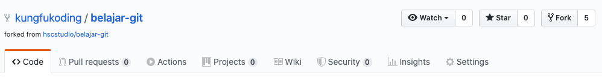
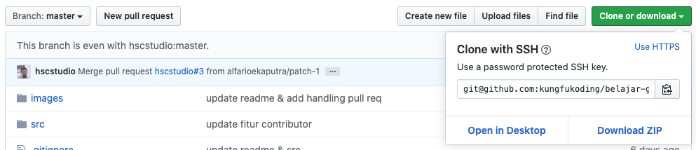
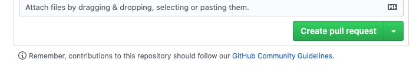

# belajar-git

Repositori (repo) ini dibuat untuk memudahkan kamu dalam belajar menggunakan git dengan cara langsung praktek. Sekaligus belajar bagaimana cara berkontribusi pada projek yang menggunakan git atau dalam hal ini github.

## Langkah Pertama!

Beberapa hal yang harus kamu persiapkan sebelum memulai semua ini.

### Instalasi Code Editor

Silakan instalasi code editor favoritmu, namun jika kamu tidak punya pilihan maka saya sarankan menggunakan Visual Studio Code di https://code.visualstudio.com

### Instalasi NodeJS & NPM

Oleh karena projek kita berbasis Javascript maka kamu perlu menginstalasi NodeJS & NPM. Software ini dapat kamu unduh pada https://nodejs.org/

Silakan download dan instalasi sesuai petunjuk disana.

Untuk memastikan bahwa node dan npm terinstalasi dengan baik pada PC-mu maka jalankan perintah berikut pada terminal:

```
node -v
npm -v
```

### Instalasi Software Git

Software git yang bisa kamu unduh di https://git-scm.com, silakan download sesuai dengan sistem operasi PCmu. Pada terminal atau command prompt (untuk kemudian saya hanya akan menyebut dengan terminal) jalankan perintah `git --version` untuk memastikan instalasi git berhasil.

> Jika perintah `git --version` gagal maka restart terminalmu sebelum menjalankan perintah ini.

### Registrasi Akun Github

Jika belum punya akun github, maka silakan registrasi pada alamat: https://github.com/join.

Hubungan komputermu dengan github, sehingga kamu tidak perlu memasukkan password githubmu ketika melakukan operasi pada suatu repo seperti saat proses push. 

- Buat SSH Keygen 
Catatan: Lewati langkah ini jika kamu sudah pernah membuatnya. SSH Keygen umumnya disimpan pada file: `~/.ssh/id_rsa.pub`.

SSH Keygen digunakan sebagai ID unik dari PC-mu. Pada terminal jalankan perintah berikut:

```
ssh-keygen -t rsa -b 4096 -C "your_email@example.com"
```

> ganti your_email@example.com dengan email kamu gunakan. ikuti langkahnya sampai selesai.

- Copy isi dari SSH Key

Copy isi dari SSH Key yang telah kamu generate, biasanya file bisa kamu temukan pada lokasi `~/.ssh/id_rsa.pub`

- Paste SSH Key tersebut pada Github

Buka https://github.com/settings/keys, lalu klik tombol `New SSH Key` maka akan muncul form. 

Isi kolom title dengan nama komputermu sedangkan kolom key diisi dengan SSH Keygen atau isi dari file `~/.ssh/id_rsa.pub`. Lalu klik tombol Add SSH Key. 

- Konfirmasi koneksi

Untuk mengkonfirmasi koneksi PC-mu dengan github maka jalankan perintah berikut:

`ssh -T git@github.com`

ikuti langkah langkahnya dan jika berhasil akan menampilkan:

`Hi username! You've successfully authenticated, but Github does not provide shell access.`

> Referensi: 
> https://help.github.com/en/github/authenticating-to-github/generating-a-new-ssh-key-and-adding-it-to-the-ssh-agent
> https://help.github.com/en/github/authenticating-to-github/adding-a-new-ssh-key-to-your-github-account
> https://kbroman.org/github_tutorial/

- Konfigurasi Akun Git Pada PC / Terminal

Jalankan perintah berikut pada terminal, sehingga ketika kita akan melakukan operasi Git maka si Git tahu bahwa kita bertindak atas nama siapa :).

```
git config --global user.email "you@example.com"
git config --global user.name "Your Name"
```

> Ganti `you@example.com` dengan email kamu dan `Your Name` dengan nama kamu.


## Langkah Kedua

Setelah semua persiapan atau langkah pertama selesai kamu kerjakan maka kita masuk ke langkah kedua yaitu mengcopy ke lokal PC.

Namun sebelum itu, jika kamu merasa terbantu dalam belajar git menggunakan repositori ini maka jangan lupa dukung repo ini dengan memberikan bintang (star) serta bagikan link repo ini ke rekanmu yang lain.


- Langkah pertama adalah mengcopy repo ini ke repo-mu (ini harus dilakukan jika kamu ingin berkontribusi pada suatu repo). Caranya: klik tombol "Fork" pada bagian kiri atas halaman sebagaimana yang ditujukkan pada gambar di atas.
Jika berhasil maka tampilan di repomu kurang lebih akan seperti berikut ini:



Perhatikan bahwa ada informasi "forked from hscstudio/belajar-git" yang menandakan bahwa repo mu itu hasil fork dari repo ini hscstudio/belajar-git.

- Copy repo hasil fork tadi ke lokal PC-mu atau istilahnya meng-clone. Caranya adalah copy 



Pilih yang use SSH ya bukan use HTTPS.

Pada contoh ini, alamatnya adalah:

`git@github.com:kungfukoding/belajar-git.git`

Tentu akan berbeda alamatnya menyesuaikan dengan nama username-mu di github. Ingat bukan clone di repo ini ya tapi direpo yang sudah kamu fork.

- Pada terminal, jalankan perintah berikut:

`git clone git@github.com:USERNAME_GUTHUBMU/belajar-git.git`

Ganti `USERNAME_GUTHUBMU` dengan username dari akun githubmu atau sesuai apa yang pada bagian sebelumnya kamu copy.

Berikut contoh tampilannya:

```
➜  latihan git clone git@github.com:kungfukoding/belajar-git.git
Cloning into 'belajar-git'...
Warning: Permanently added the RSA host key for IP address 'x.x.x.x' to the list of known hosts.
remote: Enumerating objects: 55, done.
remote: Counting objects: 100% (55/55), done.
remote: Compressing objects: 100% (45/45), done.
remote: Total 55 (delta 22), reused 32 (delta 8), pack-reused 0
Receiving objects: 100% (55/55), 509.35 KiB | 511.00 KiB/s, done.
Resolving deltas: 100% (22/22), done.
```

- Perintah diatas otomatis akan mengunduh repo hasil fork ke lokal komputer yaitu pada direktori belajar-git. Masih via terminal, jalankan perintah berikut untuk masuk ke direktori `belajar-git`

`cd belajar-git`

- instalasi repo ini

`npm install`

- jalankan code testing

`npm test`

Pastikan hasilnya semua test terpenuhi alias tidak ada yang gagal. Misalnya sebagai berikut:
```
 PASS  src/index.test.js
  ✓ contributor ready (3ms)

Test Suites: 1 passed, 1 total
Tests:       1 passed, 1 total
Snapshots:   0 total
Time:        1.469s
Ran all test suites.
```

> Silakan dipelajari dahulu source code yaitu pada folder `src/`, simple kok

## Langkah Ketiga

Tugas kamu adalah menambahkan (ingat menambahkan ya bukan mengubah) nama dan link githubmu pada file `src/index.js`. Jika sudah tambahkan code unit testing pada file `src/index.test.js`.

Pada file itu ada contohnya yaitu kode yang dikomentari, tolong jangan hapus kode yang dikomentari tersebut karena akan menjadi panduan bagi yang lain.

Namun jangan koding dulu, ikutin langkah berikutnya.

## Langkah Keempat

Tambahkan repo ini sebagai repo utama untuk memudahkan kita nantinya mengecek apakan terjadi konflik atau tidak dengan repo utama (hscstudio/belajar-git) 

- Pada terminal jalankan perintah `git remote add <nama-repo-utama> <alamat-repo>`. nama-repo-utama dapat diisikan bebas, seperti berikut:

`git remote add upstream git://github.com/hscstudio/belajar-git.git`
 
- Jalankan perintah `git status` untuk mengecek kamu saat ini berada pada branch apa. 

Contoh hasilnya:

```
On branch master
Your branch is up to date with 'origin/master'.
```

> Branch utama atau default bernama `master`, dan aturan dari repo ini adalah kamu tidak boleh melakukan perubahan kode pada branch utama secara langsung, dan supaya tidak merusak history dari proyek. Oleh karena itu kita akan membuat branch baru dan bekerja alias koding pada branch tersebut.

Jika kamu sudah merasa siap untuk melakuan perubahan maka masuk `branch` baru dengan nama fitur yang ingin kamu tambahkan yaitu `fitur_contributor`

Pada terminal jalankan perintah 

`git checkout -b fitur_contributor`

> Perintah diatas dalah singkatan dari perintah berikut:

```
git branch fitur_contributor
git checkout fitur_contributor
```

- Lakukan perubahan atau koding sesuai tugas pada Langkah Ketiga.

- Jika sudah, jalankan test `npm test`

Hasilnya harus passed semua alias tidak boleh ada yang gagal, berikut contohnya:

```
 PASS  src/index.test.js
  ✓ contributor ready (3ms)

Test Suites: 1 passed, 1 total
Tests:       1 passed, 1 total
Snapshots:   0 total
Time:        1.469s
Ran all test suites.
```

- Jika semua test telah terpenuhi maka infokan perubahan tersebut ke git, dengan perintah `git add .`
  
- Kemudian commit perubahan tersebut, dengan perintah `git commit -m "update fitur contributor"`


## Langkah Kelima

Setelah kita selesai koding maka berikutnya adalah mengirim perubahan yang kita lakukan tersebut ke repo utama.

- Pastikan bahwa kita berada pada repo master `git checkout master`
- Jalankan perintah berikut untuk memastikan branch master kita uptodate dengan cara mengambil kode dari repo utama. 

```
git fetch upstream`
git merge upstream/master
```

Berikut contoh hasilnya, jika di repo utama terdapat perubahan.

```
git merge upstream/master
Updating 4d0191c..4b3743c
Fast-forward
 README.md    | 98 ++++++++++++++++++++++++++++++++++++++++++++++++++++++++++++++++++++++---------------
 src/index.js |  3 ++-
 2 files changed, 83 insertions(+), 18 deletions(-)
```

- Setelah repo utama uptodate maka kita balik lagi ke branch `fitur_contributor`, melalui perintah berikut: `git checkout fitur_contributor`

- Berikutnya kita gabungkan perubahan kita pada branch ini ke branch master. Melalui perintah: `git rebase master`
```

Jika tidak terjadi conflict maka hasilnya sebagai berikut: 

```
git rebase master
Current branch fitur_contributor is up to date.
```

> Conflict bisa terjadi akibat ada perbedaan kode antara branch master yang telah kita update dengan branch `fitur_contributor`.

Berikut contoh tampilan jika terjadi conflict

```
git rebase master
First, rewinding head to replay your work on top of it...
Applying: update fitur contributor
Using index info to reconstruct a base tree...
M       src/index.js
Falling back to patching base and 3-way merge...
Auto-merging src/index.js
CONFLICT (content): Merge conflict in src/index.js
error: Failed to merge in the changes.
Patch failed at 0001 update fitur contributor
hint: Use 'git am --show-current-patch' to see the failed patch

Resolve all conflicts manually, mark them as resolved with
"git add/rm <conflicted_files>", then run "git rebase --continue".
You can instead skip this commit: run "git rebase --skip".
To abort and get back to the state before "git rebase", run "git rebase --abort".
```

Tampilan diatas mengindikasikan bahwa terdapat conflict pada file `src/index.js`, maka buka file itu dan silakan diperbaiki. Jika sudah diperbaiki simpan file tsb. Lalu jalankan perintah `git add src/index.js` atau lakukan untuk semua file yang conflict.

Jika sudah jangan di commit tapi langsung jalankan perintah `git rebase --continue`

Maka hasilnya kurang lebih sebagai berikut:

```
git rebase --continue 
Applying: update fitur contributor
Applying: update
Using index info to reconstruct a base tree...
M       src/index.js
.git/rebase-apply/patch:9: trailing whitespace.
  
warning: 1 line adds whitespace errors.
Falling back to patching base and 3-way merge...
Auto-merging src/index.js
```

- Jalankan rebase master lagi untuk memastikan semua conflict telah baik-baik saja `git rebase master`

- Jalankan `npm test` terakhir untuk memastikan kode perubahan kita tetap jalan sebelum di push.

- Push perubahanmu ke repomu terlebih dahulu, melalui perintah: `git push origin fitur_contributor`

Berikut ini contoh hasilnya:

```
git push origin fitur_contributor
Enumerating objects: 13, done.
Counting objects: 100% (13/13), done.
Delta compression using up to 4 threads
Compressing objects: 100% (9/9), done.
Writing objects: 100% (9/9), 808 bytes | 808.00 KiB/s, done.
Total 9 (delta 5), reused 0 (delta 0)
remote: Resolving deltas: 100% (5/5), completed with 3 local objects.
remote: 
remote: Create a pull request for 'fitur_contributor' on GitHub by visiting:
remote:      https://github.com/kungfukoding/belajar-git/pull/new/fitur_contributor
remote: 
To github.com:kungfukoding/belajar-git.git
 * [new branch]      fitur_contributor -> fitur_contributor
 ```

Hasil diatas mengindikasikan bahwa push yang kita lakukan berhasil dan si github  menyuruh kita mengakses halaman https://github.com/kungfukoding/belajar-git/pull/new/fitur_contributor untuk melakukan `pull request` kepada si pemilik repo, ikuti langkah berikutnya dulu.

- Submit perubahan atau pull request agar bisa direview oleh pemilik repo ini atau dalam hal ini saya.

Setelah push dilakukan, buka repomu pada github.

Maka akan muncul tampilan seperti di bawah ini:


- Klik tombol warna hijau yang bertuliskan `Compare & Pull Request`.


Halaman ini menampilkan perbandingan antara kode branch kita dengan kode master di repo, bagian mana yang berubah dst. Github otomatis melakukan pengecekan apakah ada conflict atau tidak. Pada contoh gambar diatas terdapat informasi `able to merge` artinya tidak ada conflict.

- Langkah berikutnya silakan isi komentar pada form tersebut kemudian klik tombol `Create pull request`.



- Tetap tenang, karena saya akan mereview `pull request`-mu pada kesempatan berikutnya, jika tidak ada conflict maka akan saya merge namun jika masih perlu perubahan akan saya cancel atau akan ada komentar dari saya pada halaman tersebut.

> Contoh penanganan pull request oleh pemilik repo [handling-pull-request](handling-pull-request.md)

- Selesai

## Kesimpulan

Demikian langkah-langkah untuk menggunakan git dan berkontribusi  pada projek bersama. Silakan dipraktekkan dan jika ada masukan jangan sungkan sungkan untuk menulis issue pada repo ini.

Salam hormat dari saya
Hafid Mukhlasin


