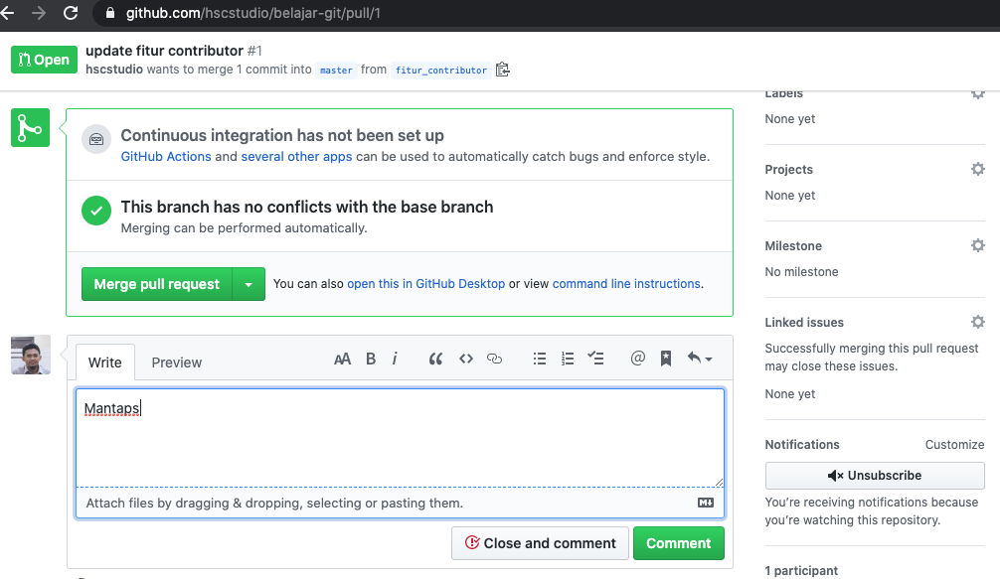
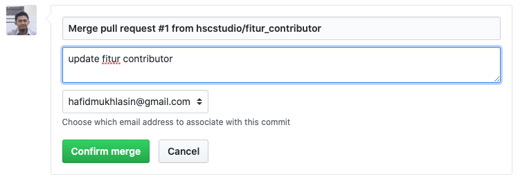
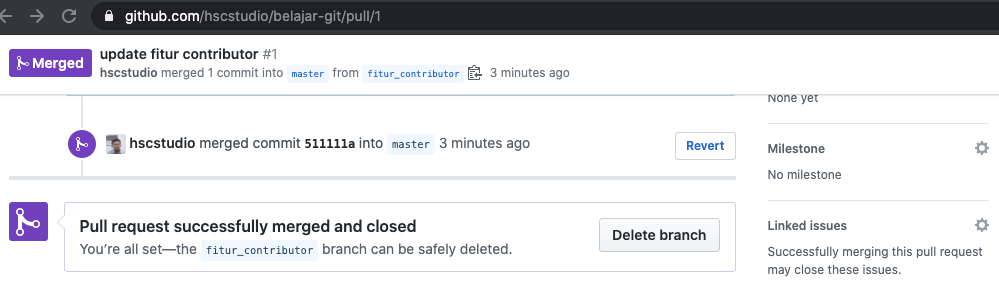

## Menangani Pull Request Bagi Pemilik Repo

Setelah user melakukan pull request maka pada halaman pull request: https://github.com/hscstudio/belajar-git/pulls akan muncul pull request dari user. 

Disitu pemilik repo bisa melakukan pengecekan apakah sudah OK atau belum.

Jika pull request masih belum OK maka pemilik bisa berkomentar, misalnya meminta user untuk memperbaikinya.

Jika pull request dirasa sudah OK maka klik tombol hijau `Merge pull request` maka akan muncul form konfirmasi  kemudian klik `Confirm merge`

Maka hasilnya adalah pull request akan di close.

